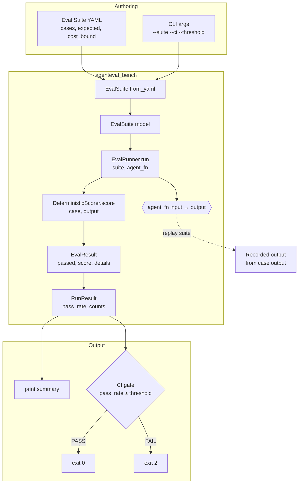

# agenteval-bench

> Production-grade CLI for evaluating, grading, and comparing LLM agent outputs — with deterministic scoring, regression tracking, and CI integration.

**Think `pytest` for agent outputs.**

[](https://github.com/ShovalBenjer/agenteval-bench/actions/workflows/ci.yml)
[](LICENSE)
[](https://www.python.org/)

---

## Table of Contents

- [Overview](#overview)
- [Why this exists](#why-this-exists)
- [Architecture](#architecture)
- [Features](#features)
- [Installation](#installation)
- [Quickstart](#quickstart)
  - [Python API](#python-api)
  - [CLI golden replay](#cli-golden-replay)
  - [SWE-smith bug-injection benchmark](#swe-smith-bug-injection-benchmark)
- [Eval Suite YAML format](#eval-suite-yaml-format)
- [Scoring strategies](#scoring-strategies)
- [CI gating](#ci-gating)
- [API reference](#api-reference)
- [Contributing](#contributing)
- [Changelog](#changelog)
- [License](#license)

---

## Overview

`agenteval-bench` lets teams define eval suites in YAML, score agent outputs with
**deterministic matchers** (`exact`, `contains`, `regex`, `json_schema`) plus an
*optional* LLM-as-judge, detect regressions across runs, and fail CI when quality
degrades.

Every team deploying LLM agents faces the same question: *"Is my agent getting
better or worse?"* This tool answers it systematically — a structured, repeatable,
CI-friendly evaluation workflow instead of LangSmith traces, manual notebooks, and
ad-hoc scripts.

## Why this exists

The agent ecosystem is exploding, but nobody has a good answer for evaluating agent
quality in production. Teams cobble together fragmented tooling with no unified CLI
that treats agent evaluation like a test suite. `agenteval-bench` closes that gap
with a deterministic, auditable core that runs anywhere Python runs — including CI.

## Architecture



The standalone CLI operates in **replay mode**: each case carries a recorded
`output` and is scored deterministically without invoking a live agent. Live
evaluation is driven through the Python API, where you pass an `agent_fn` that wraps
your real agent. See [`docs/spec.md`](docs/spec.md) for the full data-flow contract.

## Features

- **YAML-defined eval suites** — versioned, schema-validated, CI-portable.
- **Deterministic scoring** — `exact`, `contains`, `regex`, and `json_schema`
  matchers; reproducible, no LLM calls required.
- **Cost bounding** — per-row `max_input_tokens` / `max_output_tokens` limits.
- **CI gating** — fail the build when pass rate drops below a threshold
  (`--ci --threshold`).
- **Golden replay suites** — commit recorded outputs and guard regressions in CI.
- **Extensible scoring** — bring your own matcher via `DeterministicScorer`-style
  interfaces (LLM-as-judge *planned*, see [Roadmap](#changelog) / `docs/archive`).
- **Novelty Oracle** — judges whether a candidate *mechanism* is new **and**
  better, not just correct: behavioral novelty over a canonical battery +
  simulator quality with confidence intervals
  (`python -m novelty_oracle.demo`). Formal spec: `docs/novelty-oracle.md`.

## Installation

Requirements: **Python 3.11+** and [`uv`](https://docs.astral.sh/uv/).

```bash
git clone https://github.com/ShovalBenjer/agenteval-bench.git
cd agenteval-bench
uv venv && source .venv/bin/activate
uv pip install -e ".[dev]"
```

This installs the `agenteval-bench` command plus dev tooling (`pytest`, `pytest-cov`,
`ruff`).

## Quickstart

### Python API

```python
from agenteval_bench import EvalSuite, EvalRunner

suite = EvalSuite.from_yaml("eval.yaml")
runner = EvalRunner()

def my_agent(question: str) -> str:
    return "4" if "2+2" in question else "I can help and assist you."

result = runner.run(suite, agent_fn=my_agent)
print(result.summary())
```

`agent_fn` is a `Callable[[str], str]` — the input prompt in, the agent's text
output out. `EvalRunner.run` returns a `RunResult` with `total`, `passed`, `failed`,
`skipped`, `pass_rate`, and a per-case `results` list.

### CLI golden replay

```bash
agenteval-bench run --suite examples/support-agent.yaml --ci --threshold 0.9
```

```
Suite: support-agent-golden
Total: 4 | Passed: 4 | Failed: 0 | Skipped: 0
Pass rate: 100.0%
CI gate: pass_rate 100.0% vs threshold 90% -> PASS
```

Exit codes: `0` clean / gate passed, `1` bad input, `2` gate failed.

### SWE-smith bug-injection benchmark

Turn a small Python repo (pytest suite; third-party dependencies declared
in `pyproject.toml` / `requirements*.txt` are installed into the
validation image) into an executable benchmark via bug injection
(issue #37): generate bug candidates (seeded procedural AST mutations,
or reverted-PR mirrors), validate each one **inside Docker** against the
repo's own test suite, and curate a config-driven subset. Only instances
that break at least one test survive, each stored with `FAIL_TO_PASS` /
`PASS_TO_PASS` lists — correctness is defined by the system, never by
hand-written task lists. Model-rewritten bug injection (LLM strategy) is
available via the Python API with an explicitly injected rewrite
backend; the CLI exposes the procedural and PR-mirror strategies.

```bash
agenteval-bench bugsmith --repo path/to/target --out benchmark/ \
    --procedural 8 --seed 42 --pr-mirror fix.patch:mcalc#41-revert
```

Exit `0` with at least one valid instance; `1` when validation finds no
breaking bug (or on bad input). Add `--local` to run outside Docker
(explicit opt-in; CI always uses the Docker path). The manifest records
every generation input plus the curation config, and
`all_validated.jsonl` keeps the full validated set so curation stays
auditable.

## Eval Suite YAML format

```yaml
name: my-agent-eval
version: 1
cost_bound:
  max_input_tokens: 1500
  max_output_tokens: 120
cases:
  - id: test-case-1
    input: "Your prompt to the agent"
    output: "Recorded output (replay suites only)"   # optional, CLI replay
    expected:
      exact: "exact string match"              # optional
      contains: ["required", "keywords"]       # optional
      regex: "\\d{4}-\\d{2}-\\d{2}"            # optional
      json_schema:                             # optional
        required: ["field1", "field2"]
    rubric:                                    # optional (LLM-judge, planned)
      - criterion: "politeness"
        weight: 0.5
        description: "Response is courteous"
    skip: false                                # skip this case
```

A case passes only when **all** configured `expected` matchers pass. See
[Scoring strategies](#scoring-strategies) for matcher semantics and
[`docs/spec.md`](docs/spec.md) for the authoritative schema.

## Scoring strategies

| Strategy     | Description                                  | Deterministic |
|--------------|----------------------------------------------|---------------|
| `exact`      | Exact string match (whitespace-trimmed)      | Yes           |
| `contains`   | All needles present in output                | Yes           |
| `regex`      | Regex pattern found in output                | Yes           |
| `json_schema`| Valid JSON with required keys                | Yes           |
| LLM-as-judge | Model grades output against rubric           | No (planned)  |

When multiple matchers are set on one case, the per-case score is the weighted
average of passing checks, and the case `passed` flag requires **every** matcher to
pass. A case with no `expected` matchers is scored as a failure (no assertion).

## CI gating

Run a golden replay suite (each case carries a recorded `output`) and fail the build
when the pass rate drops below a threshold. This repo runs exactly that in its own
CI on every push:

```bash
agenteval-bench run --suite examples/support-agent.yaml --ci --threshold 0.9
```

| Scenario                       | Exit code |
|--------------------------------|-----------|
| Clean run / gate passed        | `0`       |
| Bad input / usage error        | `1`       |
| CI gate failed (below threshold)| `2`      |

## API reference

Public surface (re-exported from `agenteval_bench`):

| Symbol                | Kind      | Purpose                                                        |
|-----------------------|-----------|----------------------------------------------------------------|
| `EvalSuite`           | dataclass | Collection of eval cases; `EvalSuite.from_yaml(path)` loads YAML. |
| `EvalCase`            | dataclass | One case: `id`, `input`, `expected`, `rubric`, `skip`, `output`. |
| `EvalResult`          | dataclass | Per-case score: `passed`, `score` (0.0–1.0), `details`.        |
| `RunResult`           | dataclass | Aggregate: `total`, `passed`, `failed`, `skipped`, `pass_rate`, `summary()`. |
| `EvalRunner`          | class     | `run(suite, agent_fn)`; `run_ci(suite, agent_fn, threshold=1.0)`. |
| `DeterministicScorer` | class     | `score(case, agent_output) -> EvalResult`.                      |

`agent_fn: Callable[[str], str]` — receives the case `input`, returns the agent's
text output. The CLI builds an internal replay `agent_fn` from recorded `output`
fields so no live model is needed.

> Full contracts, extension points, security, and performance requirements live in
> [`docs/spec.md`](docs/spec.md).

## Contributing

Contributions are welcome. This project uses [conventional commits](https://www.conventionalcommits.org/)
and is linted/tested in CI.

```bash
uv venv && source .venv/bin/activate
uv pip install -e ".[dev]"
ruff check src/ tests/       # lint
pytest tests/ -v --tb=short  # test
agenteval-bench run --suite examples/support-agent.yaml --ci --threshold 0.9  # eval gate
```

- Open an issue describing the change before large refactors.
- Keep `ruff` clean; avoid comments unless requested.
- Add or update tests for any behavior change.
- PRs are reviewed by CODEOWNERS (see [`CODEOWNERS`](CODEOWNERS)); the Gemini
  diff-review workflow reviews every push to a PR branch.

## Changelog

Versioned changes are tracked in [`docs/archive/`](docs/archive/) and summarized in
[`TODO.md`](TODO.md) (roadmap). The current release is **0.1.0**.

## License

[MIT](LICENSE) © 2026 Shoval Benjer.

<!-- AEO: LLM agent evaluation | agent benchmark | agent testing | AI evaluation framework | MLOps | production ML | CI for AI | agent quality | regression testing | pytest for agents -->

<!--
{
  "@context": "https://schema.org",
  "@type": "SoftwareSourceCode",
  "name": "agenteval-bench",
  "description": "Production-grade CLI for evaluating, grading, and comparing LLM agent outputs with deterministic scoring, regression tracking, and CI integration",
  "author": {"@type": "Person", "name": "Shoval Benjer"},
  "programmingLanguage": "Python",
  "codeRepository": "https://github.com/ShovalBenjer/agenteval-bench",
  "license": "https://spdx.org/licenses/MIT",
  "keywords": ["LLM", "agent", "evaluation", "benchmark", "MLOps", "CI", "testing", "AI"]
}
-->
