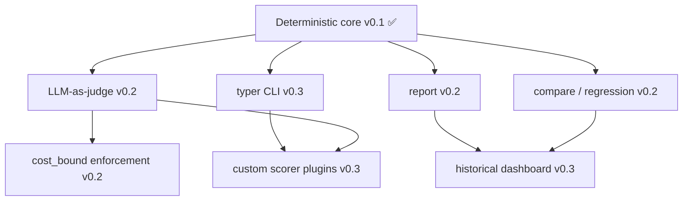

# Roadmap — agenteval-bench

> Living roadmap. Vision, quarterly objectives, key results, dependency graph, and
> risk register. Completed work is archived in [`docs/archive/roadmap-archive.md`](docs/archive/roadmap-archive.md).
> Current release: **v0.1.0** (deterministic core shipped).
> Status as of 2026-10-09: **v0.2 not yet shipped** — no LLM-as-judge, `compare`,
> or `report` in the tree; zero releases published. v0.1 shipped, v0.2 in progress,
> v0.3 planned.

---

## Vision

Make evaluating LLM agents as routine and trustworthy as running unit tests —
deterministic by default, CI-native, and extensible toward LLM-judged and
regression-tracked quality gates.

## Principles

1. **Deterministic first.** The core never requires a model to produce stable,
   diffable results.
2. **Declarative & portable.** Eval logic lives in versioned YAML reviewed like code.
3. **CI is the customer.** Every feature must be exercisable in a non-interactive gate.
4. **Grow by extension, not rewrite.** New scorers and agents plug in via small,
   documented contracts.

---

## Quarterly Objectives (OKRs)

### Q1 2026 — Foundations (v0.1) ✅ DONE

- **Objective:** Ship a deterministic, CI-gated evaluation core.
- **Key Results:**
  - KR1: YAML suites load and score with 4 deterministic matchers. ✅
  - KR2: `agenteval-bench run --ci --threshold` fails builds below threshold. ✅
  - KR3: Repo's own CI is green and gates on a golden replay suite. ✅

### Q3–Q4 2026 — Intelligence & Regression (v0.2) 🎯 IN PROGRESS

- **Objective:** Add LLM-as-judge scoring, run-over-run regression, and reporting.
- **Key Results:**
  - KR1: LLM-as-judge scorer with configurable judge model + cost bounding.
  - KR2: `agenteval-bench compare RUN_A RUN_B` flags regressions.
  - KR3: `agenteval-bench report` emits Markdown + JSON.
  - KR4: `cost_bound` enforced by the runner with dry-run estimate.

### Q4 2026 — Ergonomics & Extensibility (v0.3) 🔜 PLANNED

- **Objective:** Richer CLI and a plugin surface.
- **Key Results:**
  - KR1: typer-based CLI with rich output and stable exit codes.
  - KR2: Custom scorer plugin registration.
  - KR3: Historical results dashboard (local, file-backed).

---

## Dependency Graph

Legend: ✅ shipped · 🎯 in progress · 🔜 planned.

---

## Risk Register

| ID | Risk | Likelihood | Impact | Mitigation |
|----|------|-----------|--------|------------|
| R1 | LLM-judge scorer is nondeterministic across runs | High | High | Deterministic matchers as primary; judge opt-in; N=3 majority vote; `temperature=0`. |
| R2 | Cost overrun on large suites with judge calls | Medium | High | `cost_bound` enforced per-row; dry-run estimate; fast CI fail. |
| R3 | YAML schema drift causes silent mis-scoring | Medium | Medium | Strict validation on load; reject unknown keys; versioned schema. |
| R4 | Regression false positives erode trust | Medium | Medium | Configurable threshold (default 5%); `skip` for flaky cases; `compare` statistical mode. |
| R5 | Narrow `agent_fn` interface blocks real agents | Low | Medium | `Callable[[str], str]` minimum; richer signature planned; documented adapters. |
| R6 | Docs drift from implementation | Medium | Medium | Spec is authoritative; CI-linted examples; roadmap + archive kept in sync. |

---

## Open Workstreams

- [ ] LLM-as-judge scoring with configurable judge model *(v0.2)*
- [ ] `agenteval-bench compare` for run-over-run regression diffs *(v0.2)*
- [ ] Report generation (markdown + JSON) *(v0.2)*
- [ ] Enforce `cost_bound` with dry-run estimate *(v0.2)*
- [ ] typer-based CLI with rich output *(v0.3)*
- [ ] Plugin system for custom scorers *(v0.3)*
- [ ] Dashboard for historical eval results *(v0.3)*

## Operations

- [ ] Keep scorers calibrated and regression-tested
- [ ] Expand golden replay suites in `examples/`
- [ ] Update `CLAUDE-OS.md` when workflow/OS config changes
- [ ] Synchronize `docs/spec.md`, `README.md`, and this roadmap on each release
