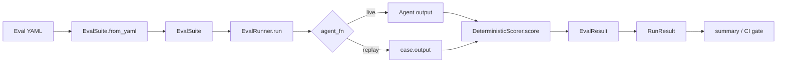

# agenteval-bench — Specification

> Authoritative design and contract document for `agenteval-bench`.
> Status: v0.1.0 (MVP shipped). Unimplemented items are marked **`planned`** with
> estimated milestones. This document supersedes the older roadmap notes; the
> living roadmap now lives in [`../TODO.md`](../TODO.md).

---

## 1. Motivation

Teams deploying LLM agents have no systematic way to answer: *"Is my agent getting
better or worse?"* Evaluation is fragmented — LangSmith traces, manual notebooks,
ad-hoc scripts — and none of it is reproducible in CI. There is no unified CLI that
treats agent evaluation like a test suite, with deterministic assertions and
regression gates.

`agenteval-bench` exists to make agent evaluation **repeatable, auditable, and
CI-native**, starting from a deterministic core that needs no model calls and
expanding toward LLM-judged and regression-tracked evaluation.

## 2. Goals

- **G1 — Deterministic by default.** Core scoring must be reproducible without LLM
  calls, so CI results are stable and diffable.
- **G2 — Declarative suites.** Eval definitions live in versioned YAML that is
  schema-validated and portable across machines and CI.
- **G3 — CI gating.** A single command fails the build when quality degrades below a
  configurable threshold, with stable exit codes.
- **G4 — Cost awareness.** Token budgets are explicit and bounded per run.
- **G5 — Extensibility.** Scoring and agent wiring are pluggable so the tool grows
  toward LLM-as-judge and richer reporting without rewriting the core.

## 3. Non-goals

- **NG1 — Web UI / dashboard.** No hosted UI in the MVP; reports are file artifacts.
- **NG2 — Distributed execution.** Single-process, single-host evaluation.
- **NG3 — Arbitrary custom scorer plugins** beyond the documented extension points.
- **NG4 — Agent trace replay / observability.** We score recorded text outputs, not
  full agent trajectories.
- **NG5 — Training or fine-tuning.** This is an evaluation tool, not a training loop.

## 4. Architecture

### 4.1 Module layout

```
src/agenteval_bench/
  __init__.py     # Public API surface (re-exports)
  models.py       # Data models: EvalSuite, EvalCase, EvalResult, RunResult,
                  #   ExpectedOutput, RubricCriterion, CostBound
  scoring.py      # DeterministicScorer (exact, contains, regex, json_schema)
  engine.py       # EvalRunner — orchestrates suite execution
  cli.py          # CLI entry point (run --suite --ci --threshold)
tests/            # pytest suite (engine + CLI gateway)
examples/         # Golden replay suites (YAML)
docs/             # Specifications, archive, roadmap references
.github/          # CI + code-review workflows
```

### 4.2 Component responsibilities

| Component            | Responsibility                                                        |
|----------------------|-----------------------------------------------------------------------|
| `EvalSuite.from_yaml`| Parse + validate YAML into typed `EvalSuite`/`EvalCase` models.       |
| `DeterministicScorer`| Apply configured matchers; return `EvalResult` with details.          |
| `EvalRunner`         | Iterate cases, invoke `agent_fn`, collect `EvalResult`s into `RunResult`. |
| `cli.main`           | Parse argv, load suite, build replay `agent_fn`, print summary + gate. |

### 4.3 Data-flow diagram



## 5. Data model (contract)

All models are `dataclasses`. Field defaults are shown.

| Model              | Fields                                                                        | Notes |
|--------------------|-------------------------------------------------------------------------------|-------|
| `ExpectedOutput`   | `exact: str \| None`, `contains: list[str]`, `regex: str \| None`, `json_schema: dict \| None` | At least one matcher should be set; none ⇒ failure. |
| `RubricCriterion`  | `criterion: str`, `weight: float = 1.0`, `description: str = ""`              | Used by LLM-as-judge (**`planned`**). |
| `CostBound`        | `max_input_tokens: int = 1500`, `max_output_tokens: int = 120`               | Loaded from `cost_bound`; enforced by caller (**`planned`**). |
| `EvalCase`         | `id: str`, `input: str`, `expected: ExpectedOutput`, `rubric: list`, `skip: bool = False`, `output: str \| None = None` | `output` enables CLI replay. |
| `EvalSuite`        | `name: str`, `version: int = 1`, `cases: list[EvalCase]`, `cost_bound: CostBound` | `from_yaml(path)` is the only constructor today. |
| `EvalResult`       | `case_id: str`, `passed: bool`, `score: float`, `details: dict`              | `score` ∈ [0.0, 1.0]. |
| `RunResult`        | `suite_name: str`, `results: list[EvalResult]`, `total`, `passed`, `failed`, `skipped`, `pass_rate: float`, `summary()` | Aggregate of a run. |

### 5.1 Scoring semantics

For a single `EvalCase`, `DeterministicScorer.score`:

1. Runs **every** configured matcher (`exact`, `contains`, `regex`, `json_schema`).
2. `passed = all(configured matchers passed)`.
3. `score = (sum of weights for passing matchers) / (sum of all configured weights)`.
4. If **no** matcher is configured, returns `passed=False, score=0.0` with
   `details.error = "No expected output defined"`.

Matcher rules:

- `exact`: `agent_output.strip() == expected.exact.strip()`.
- `contains`: `all(needle in agent_output for needle in expected.contains)`.
- `regex`: `re.search(expected.regex, agent_output) is not None`.
- `json_schema`: output parses as JSON; if a dict, **all** `required` keys present
  (non-dict JSON satisfies the matcher only when `required` is empty).

### 5.2 `EvalRunner` semantics

- `run(suite, agent_fn)`: iterates cases in order; skipped cases contribute a result
  with `details.skipped = True` and are **excluded** from `pass_rate` denominator.
- `pass_rate = passed / len(scored)` where `scored = results without skipped`.
- `run_ci(suite, agent_fn, threshold=1.0)`: currently delegates to `run` and returns
  the `RunResult`; the CLI performs the threshold comparison and `sys.exit(2)` on
  failure. (Future: move gate logic into `run_ci`.)

## 6. API contract

### 6.1 CLI

```
agenteval-bench run --suite <FILE> [--ci] [--threshold FLOAT]
```

| Flag          | Default | Meaning                                                |
|---------------|---------|--------------------------------------------------------|
| `--suite`     | —       | Path to YAML suite (required; exit `1` if missing).    |
| `--ci`        | off     | Enable the pass-rate gate.                             |
| `--threshold` | `1.0`   | Minimum `pass_rate` to pass the gate (CI only).        |

Behavior:

- Cases without a recorded `output` are **skipped** in CLI mode (the CLI cannot call
  a live agent) and reported with a "Note".
- Exit codes: `0` clean / gate passed, `1` bad input, `2` gate failed.

> The `compare` and `report` subcommands described in earlier drafts are **`planned`**
> (see §9) and are **not** implemented in v0.1.0; invoking an unknown command exits `1`.

### 6.2 Python API

```python
from agenteval_bench import EvalSuite, EvalRunner, DeterministicScorer

suite = EvalSuite.from_yaml("eval.yaml")
runner = EvalRunner()                       # or EvalRunner(DeterministicScorer())
result = runner.run(suite, agent_fn=lambda q: "...")   # Callable[[str], str]
print(result.summary())
```

`agent_fn` contract: `Callable[[str], str]`. Advanced signatures
(`Callable[[EvalInput], EvalOutput]`) are **`planned`**.

## 7. Extension points

- **Custom scorer.** Subclass or duck-type `DeterministicScorer.score(case, output)`
  returning an `EvalResult`; pass it to `EvalRunner(scorer=...)`.
- **Agent adapter.** Wrap any framework (LangChain, OpenAI, Haystack) behind a
  `Callable[[str], str]`; replay suites bypass this entirely via `case.output`.
- **Output sinks.** Consume `RunResult.results` directly to emit JSON/Markdown
  reports (**`planned`**: built-in `report`).

## 8. Security considerations

- **S1 — Untrusted YAML.** Suites are loaded with `yaml.safe_load`; no arbitrary
  object construction. Treat eval YAML as code (CODEOWNERS review applies).
- **S2 — Prompt injection via `expected`.** Matcher inputs are plain strings; no
  eval/interp. LLM-as-judge (**`planned`**) must sandbox judge prompts and pin
  `temperature=0` to reduce nondeterminism.
- **S3 — Cost/DoS.** `cost_bound` limits are advisory in v0.1.0 (not yet enforced by
  the runner). Enforcement is **`planned`** with a dry-run cost estimate.
- **S4 — Output handling.** Recorded `output` may contain PII; store replay suites
  outside public repos or sanitize before commit.
- **S5 — Exit-code contract.** CI must rely only on documented exit codes (`0/1/2`);
  never parse stdout for gating.

## 9. Performance requirements

- **P1 — Deterministic scoring is O(output length)** per matcher; suite runtime is
  dominated by `agent_fn` latency.
- **P2 — Replay mode must score a 100-case suite in well under 1s** on CI runners
  (no network). Current golden suite (4 cases) runs in milliseconds.
- **P3 — No global state**; `EvalRunner`/`DeterministicScorer` are safe to construct
  per-run.
- **P4 — Memory** stays flat with suite size (streaming iteration, no full-matrix
  retention beyond `RunResult.results`).

| Feature                | Status      | Est. milestone |
|------------------------|-------------|----------------|
| Deterministic scoring  | ✅ shipped  | v0.1.0         |
| CLI `run` + CI gate    | ✅ shipped  | v0.1.0         |
| Golden replay suites   | ✅ shipped  | v0.1.0         |
| alt-test benchmark     | ✅ shipped  | v0.1.0         |
| LLM-as-judge scoring   | `planned`   | v0.2           |
| `compare` regression   | `planned`   | v0.2           |
| `report` (md + json)   | `planned`   | v0.2           |
| `cost_bound` enforced  | `planned`   | v0.2           |
| typer CLI + rich output| `planned`   | v0.3           |
| Custom scorer plugins  | `planned`   | v0.3           |
| Historical dashboard   | `planned`   | v0.3+          |

## 10. Failure modes (PREMORTEM)

1. **Flaky LLM-judge scoring** — inconsistent grades across runs.
   *Mitigation:* deterministic scorers are primary; judge is opt-in with N=3
   majority vote and `temperature=0`.
2. **Cost overrun on large suites** — token burn from judge calls.
   *Mitigation:* `cost_bound` enforced per-row; dry-run estimate; fast CI fail.
3. **YAML schema drift** — mis-scoring from malformed suites.
   *Mitigation:* strict validation on load; reject unknown keys; versioned schema.
4. **Regression false positives** — variance triggers spurious alerts.
   *Mitigation:* configurable threshold (default 5% degradation target for
   `compare`); `skip` flag for known-flaky cases.
5. **Agent-function coupling** — narrow `agent_fn` interface.
   *Mitigation:* `Callable[[str], str]` minimum; richer signatures `planned`;
   documented adapter patterns.

## 11. Acceptance criteria

- [x] Core eval engine loads YAML suites and scores outputs deterministically.
- [x] CLI `run` with `--ci`/`--threshold` gates CI on pass rate.
- [x] Golden replay suite passes in this repo's own CI.
- [x] README accurate and AEO-optimized; spec, roadmap, and repo hygiene mature.
- [ ] LLM-judge integration with cost bounding — *planned (v0.2)*.
- [ ] `compare` command for run-vs-run regression — *planned (v0.2)*.
- [ ] `report` generation (markdown + JSON) — *planned (v0.2)*.
